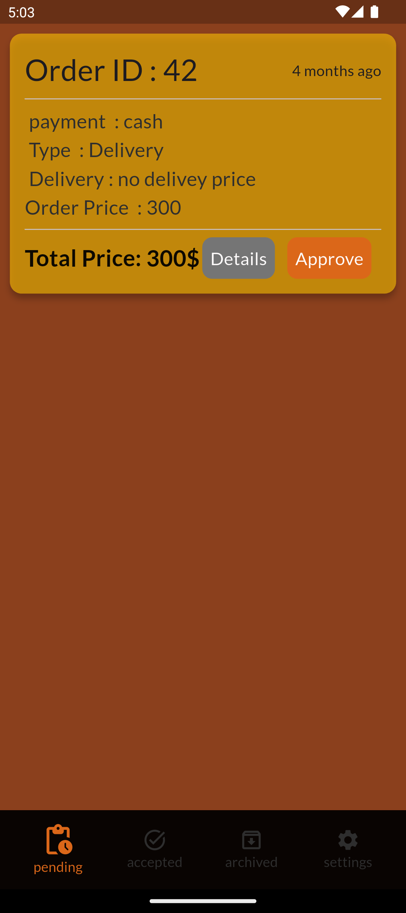
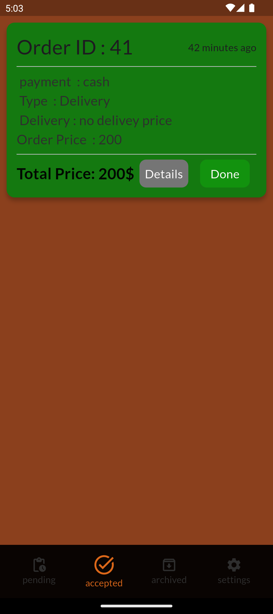
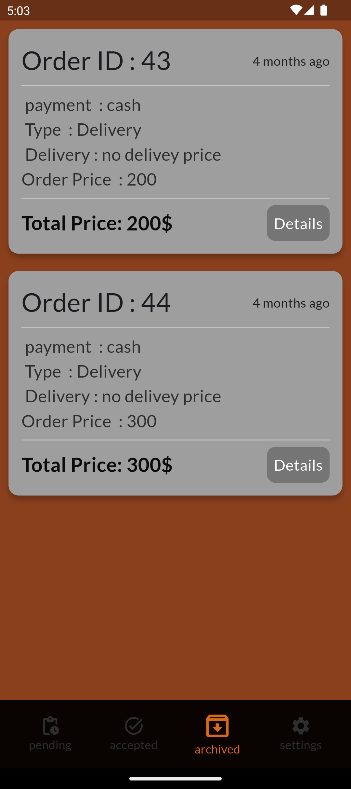
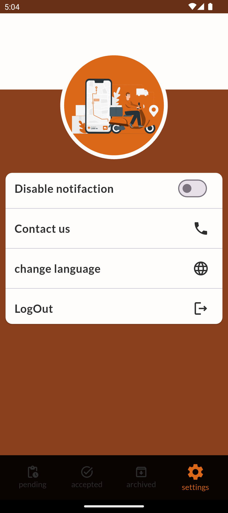

# سوف الخاميس نخت عامل التـوصيل

تطبيق يخص souq_al_khamis لتنظيم الدلفري من اوردارت تم قبولها لتوصيلها و تحت التجهيز و تم توصيلها 

## نـظرة عــامة

A few resources to get you started if this is your first Flutter project:

- [Lab: Write your first Flutter app](https://docs.flutter.dev/get-started/codelab)
- [Cookbook: Useful Flutter samples](https://docs.flutter.dev/cookbook)

For help getting started with Flutter development, view the
[online documentation](https://docs.flutter.dev/), which offers tutorials,
samples, guidance on mobile development, and a full API reference.
